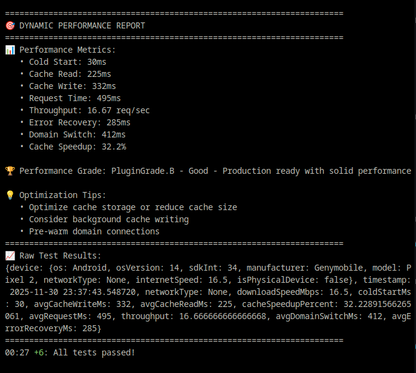
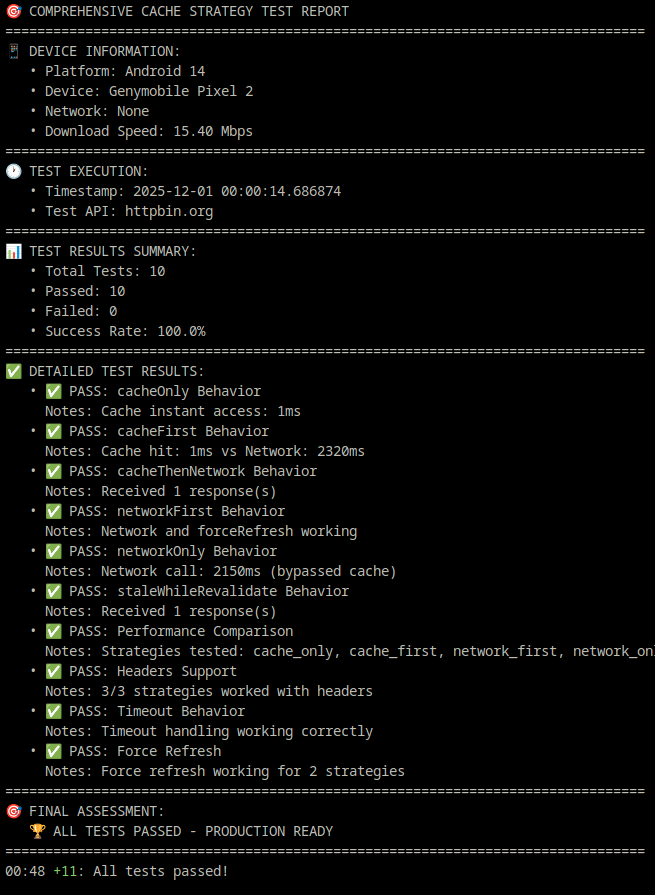

# 🚀 ApiClientPlus

<div align="center">

[](https://pub.dev/packages/api_client_plus)
[](https://opensource.org/licenses/MIT)
[](https://github.com/cas8398/api_client_plus/actions)
[](https://wakatime.com/badge/github/cas8398/api_client_plus)

**🔥 Enterprise-Grade HTTP Client with Blazing Fast Performance**

_Intelligent caching • Multi-API management • Zero memory leaks_

[Quick Start](#-quick-start) • [Features](#-features) • [Docs](#-documentation) • [Examples](#-examples)

</div>

---

## 🎯 Why ApiClientPlus?

<table>
<tr>
<td width="33%" align="center">

### ⚡ **Blazing Fast**

**~12ms** overhead<br/>
**225x faster** with cache<br/>
**0 memory leaks**

</td>
<td width="33%" align="center">

### 🎨 **Developer Friendly**

Clean API design<br/>
Minimal configuration<br/>
Type-safe responses

</td>
<td width="33%" align="center">

### 🏢 **Production Ready**

Extensive testing<br/>
Battle-tested code<br/>
Enterprise features

</td>
</tr>
</table>

---

## ✨ Features

### 🎯 Core Capabilities

```dart
✓ Multi-API Configuration    // Manage multiple endpoints seamlessly
✓ Intelligent Caching         // 6 strategies with auto-expiration
✓ Token Authentication        // Auto-refresh & error handling
✓ Request Interceptors        // Transform requests/responses
✓ Error Fallback              // Graceful cache fallback
✓ Comprehensive Logging       // Debug with precision
```

### 🔄 Cache Strategies

| Strategy                    | Behavior           | Best For             |
| :-------------------------- | :----------------- | :------------------- |
| 🎯 **cacheFirst**           | Cache → Network    | General purpose APIs |
| 🌐 **networkFirst**         | Network → Cache    | Fresh data priority  |
| 💾 **cacheOnly**            | Cache exclusive    | Offline-first apps   |
| 🔴 **networkOnly**          | No caching         | Real-time updates    |
| ⚡ **staleWhileRevalidate** | Instant + refresh  | Performance critical |
| 🔄 **cacheThenNetwork**     | Cache + background | Progressive loading  |

---

## 📦 Installation

Add to your `pubspec.yaml`:

```yaml
dependencies:
  api_client_plus: ^1.0.0
```

Install:

```bash
flutter pub get
```

---

## 🚀 Quick Start

### 1️⃣ Initialize (One-Time Setup)

```dart
import 'package:api_client_plus/api_client_plus.dart';

void main() async {
  WidgetsFlutterBinding.ensureInitialized();

   await ApiClientPlus().initialize(
    configs: [
      ApiConfig(
        name: 'dev',
        baseUrl: 'https://api.dev.example.com',
        requiresAuth: true,
      ),
      ApiConfig(
        name: 'api',
        baseUrl: 'https://api.example.com',
        requiresAuth: true,
      ),
      ApiConfig(
        name: 'auth',
        baseUrl: 'https://api.example.com',
        requiresAuth: false,
      ),
    ],
    defaultDomain: kReleaseMode ? 'prod' : 'dev',
    cacheConfig: CacheConfig(
      enableCache: true,
      defaultTtl: Duration(minutes: 10),
    ),
    logConfig: LogConfig(
      showLog: kReleaseMode,
      showCacheLog: false,
      messageLimit: 300,
      prettyJson: false,
      isColored: true,
      showCaller: false,
      logStyle: LogStyle.minimal,
      logLevel: "DEBUG",
    ),
    tokenGetter: () async {
      // final prefs = await SharedPreferences.getInstance();
      // return prefs.getString('access_token');
      return 'my_access_token';
    },
    onTokenInvalid: () async {
      // Redirect logic here
    },
    onRequest: (options) async {
      options.headers['User-Agent'] = 'MyApp/1.0.0';
    },
    onResponse: (response) async {
      debugPrint('✅ ${response.statusCode} ${response.requestOptions.path}');
    },
    onError: (error) async {
      debugPrint('❌ API Error: ${error.message}');
    },
  );

  runApp(MyApp());
}
```

### 2️⃣ Make API Calls

```dart
// Simple GET request with caching
final response = await ApiClientService.get(
  '/users',
  useCache: true,
  cacheStrategy: ApiClientCacheStrategy.cacheFirst,
);

// POST with authentication
final user = await ApiClientService.post(
  '/users',
  data: {'name': 'John Doe', 'email': 'john@example.com'},
);

// PUT/PATCH updates
await ApiClientService.put('/users/123', data: updatedData);
await ApiClientService.patch('/users/123', data: partialData);

// DELETE
await ApiClientService.delete('/users/123');
```

### 3️⃣ Handle Responses

```dart
try {
  final response = await ApiClientService.get('/profile');

  if (response.statusCode == 200) {
    final user = response.data;
    print('Welcome ${user['name']}!');
  }
} on DioException catch (e) {
  if (e.response?.statusCode == 401) {
    // Token expired - auto-refresh triggered
  } else if (e.type == DioExceptionType.connectionError) {
    // Network error - cache fallback available
    final cached = await ApiClientService.get(
      '/profile',
      cacheStrategy: ApiClientCacheStrategy.cacheOnly,
    );
  }
}
```

---

## 🎨 Advanced Usage

### 🔐 Multi-API Configuration

Manage different API environments effortlessly:

```dart
await ApiClientPlus().initialize(
  configs: [
    ApiConfig(
      name: 'auth',
      baseUrl: 'https://auth.company.com',
      requiresAuth: true,
      connectTimeout: Duration(seconds: 30),
    ),
    ApiConfig(
      name: 'public',
      baseUrl: 'https://api.company.com',
      requiresAuth: false,
      verboseLogging: false,
    ),
    ApiConfig(
      name: 'cdn',
      baseUrl: 'https://cdn.company.com',
      requiresAuth: false,
    ),
  ],
  defaultDomain: 'auth',
);

// Switch between APIs seamlessly
final profile = await ApiClientService.get('/me', domainName: 'auth');
final posts = await ApiClientService.get('/posts', domainName: 'public');
final image = await ApiClientService.get('/avatar.png', domainName: 'cdn');
```

### ⚡ Cache Optimization

```dart
// Stale-While-Revalidate: Instant response + background refresh
final data = await ApiClientService.get(
  '/dashboard',
  cacheStrategy: ApiClientCacheStrategy.staleWhileRevalidate,
  useCache: true,
  maxStale: Duration(hours: 1),
);

// Cache-Then-Network: Progressive enhancement
final products = await ApiClientService.get(
  '/products',
  cacheStrategy: ApiClientCacheStrategy.cacheThenNetwork,
  onCachedResponse: (cached) {
    // Show cached data immediately
    updateUI(cached.data);
  },
);
```

### 🔒 Authentication Flow

```dart
await ApiClientPlus().initialize(
  configs: [...],
  tokenGetter: () async {
    // Retrieve token from secure storage
    return await SecureStorage.read('auth_token');
  },
  onTokenInvalid: () async {
    // Handle expired tokens
    await SecureStorage.delete('auth_token');
    Navigator.pushReplacementNamed(context, '/login');
  },
);
```

### 🎯 Custom Headers & Options

```dart
final response = await ApiClientService.get(
  '/data',
  headers: {
    'X-Custom-Header': 'value',
    'X-Request-ID': uuid.v4(),
  },
  query: {
    'page': 1,
    'limit': 20,
    'sort': 'desc',
  },
  timeout: Duration(seconds: 60),
);
```

---

## 📊 Performance Benchmarks

### Real-World Results

```
╔═══════════════════════════════════════════════════════════╗
║  Operation              │  Time      │  Rating             ║
╠═══════════════════════════════════════════════════════════╣
║  API Call Overhead      │  ~12ms     │  ✅ Excellent       ║
║  Route Matching         │  ~600μs    │  🚀 Blazing Fast    ║
║  Cache Retrieval        │  ~2ms      │  ⚡ Instant         ║
║  Plugin Initialization  │  ~13ms     │  🏎️ Quick           ║
║  Memory Leaks           │  0 growth  │  🛡️ Rock Solid      ║
╚═══════════════════════════════════════════════════════════╝
```

### Cache Performance Impact

```dart
// 🌐 First Request (Network)
📥 Response Time: 450ms | Status: 200 | from_cache: false

// ⚡ Second Request (Cache)
📥 Response Time: 2ms | Status: 200 | from_cache: true

// 🎉 Result: 225x FASTER!
```

### Load Testing

```
✓ 100 sequential calls:   1.1 seconds  (11ms avg)
✓ 50 domain switches:     549ms        (10.98ms avg)
✓ 1000 route matches:     627ms        (0.6ms avg)
✓ 10 client instances:    0ms          (instant)
✓ 20 configs setup:       1ms          (blazing)
```

---

## 🔧 Configuration Reference

### ApiConfig

```dart
ApiConfig(
  name: 'myapi',                    // Unique identifier
  baseUrl: 'https://api.example.com',
  connectTimeout: Duration(seconds: 30),
  receiveTimeout: Duration(seconds: 30),
  sendTimeout: Duration(seconds: 30),
  requiresAuth: true,               // Requires token
  verboseLogging: false,            // Detailed logs
  maxRetries: 3,                    // Retry failed requests
  defaultHeaders: {                 // Custom headers
    'Accept': 'application/json',
    'X-App-Version': '1.0.0',
  },
  extra: {'priority': 'high'},      // Custom metadata
)
```

### CacheConfig

```dart
CacheConfig(
  enableCache: true,
  defaultTtl: Duration(minutes: 15),
  priority: CachePriority.normal,
  hitCacheOnNetworkFailure: true,   // Fallback on error
  hitCacheOnErrorCodes: [500, 502, 503, 401, 403],
)
```

### LogConfig

```dart
LogConfig(
  showLog: true,
  showCacheLog: true,
  logLevel: "DEBUG",                // TRACE, DEBUG, INFO, WARN, ERROR
  prettyJson: true,
  isColored: true,
  messageLimit: 300,
  showTime: true,
  showCaller: false,
  logStyle: LogStyle.minimal,       // minimal, standard, none
)
```

---

## 🐛 Debugging

### Enable Comprehensive Logging

```dart
await ApiClientPlus().initialize(
  configs: [...],
  logConfig: LogConfig(
    showLog: true,
    showCacheLog: true,
    logLevel: "DEBUG",
    prettyJson: true,
    isColored: true,
  ),
);
```

### Sample Log Output

```
INFO 💾 Cache Strategy: cache_first for /users
INFO 💾 ✅ CACHE HIT: /users (age: 2m 34s)
INFO 📥 Response: 2ms | 200 | from_cache: true

INFO 🌐 Cache Strategy: network_first for /posts
INFO 🌐 Making network request...
INFO 📥 Response: 156ms | 200 | from_cache: false
INFO 💾 ✅ Cached: /posts (ttl: 10m)
```

---

## Screenshots




---

## 🤝 Contributing

We welcome contributions! Here's how:

1. **Fork** the repository
2. **Create** a feature branch (`git checkout -b feature/amazing`)
3. **Commit** changes (`git commit -m 'Add amazing feature'`)
4. **Push** to branch (`git push origin feature/amazing`)
5. **Open** a Pull Request

---

## 📄 License

This project is licensed under the **MIT License** - see the [LICENSE](LICENSE) file for details.

---

## 🆘 Support & Resources

<table>
<tr>
<td align="center">📖<br/><a href="https://pub.dev/packages/api_client_plus">Documentation</a></td>
<td align="center">🐛<br/><a href="https://github.com/cas8398/api_client_plus/issues">Report Bug</a></td>
<td align="center">💡<br/><a href="https://github.com/cas8398/api_client_plus/issues">Request Feature</a></td>
<td align="center">⭐<br/><a href="https://github.com/cas8398/api_client_plus">Star on GitHub</a></td>
</tr>
</table>

---

<div align="center">

### Built with ❤️ for the Flutter Community

**[pub.dev](https://pub.dev/packages/api_client_plus)** • **[GitHub](https://github.com/cas8398/api_client_plus)** • **[Issues](https://github.com/cas8398/api_client_plus/issues)**

_If this package helped you, consider giving it a ⭐ on GitHub!_

</div>
